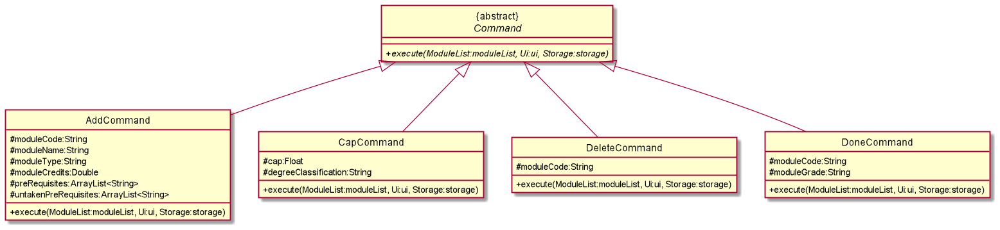
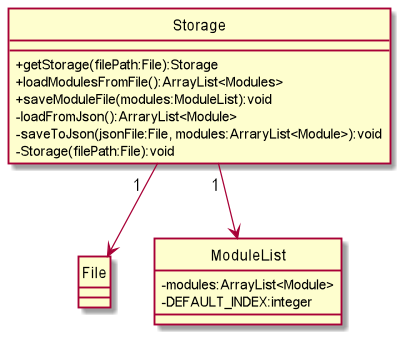
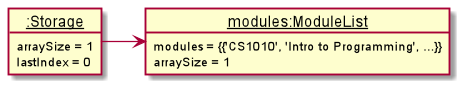
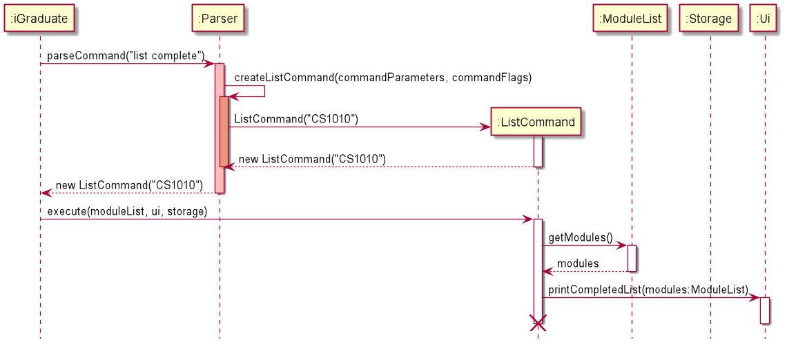
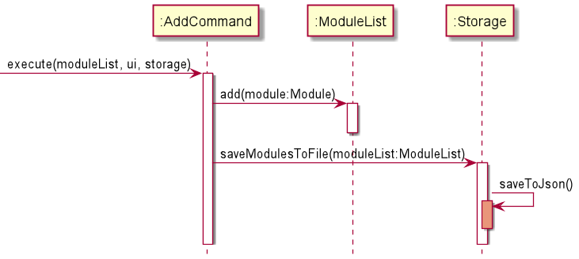

<!--@@author xseh-->

# **iGraduate Developer Guide** #
Project by: `W09-2` Latest update: `11 April 2021`

## **Table of Contents** ##
1. [Introduction](#introduction)
1. [Developer Guide Usage](#developer-guide-usage)
1. [Setting up, Getting Started](#setting-up-getting-started)
    - [Terminal](#terminal)
    - [IntelliJ IDEA](#intellij-idea)
1. [Design](#design)
    - [Architecture](#architecture)
    - [UI Component](#ui-component)
    - [Logic Component](#logic-component)
        - [Parser Class](#parser-class)
        - [Command Package](#command-package)
    - [Model Component](#model-component)
        - [`module` Package](#module-package)
            - [`Module` Class](#module-class)
        - [`list` Package](#list-package)
            - [`ModuleList` Class](#modulelist-class)
    - [Storage Component](#storage-component)
    - [Common Classes](#common-classes)
1. [Implementation](#implementation)
    - [UI](#ui)
    - [Parser](#parser)
    - [Command](#command)
    - [Module](#module)
    - [ModuleList](#modulelist)
    - [Storage](#storage)
    - [Exception](#exception)
1. [Logging](#logging)
1. [Documentation](#documentation)
1. [Appendix A: Product Scope](#appendix-a-product-scope)
    - [Target User Profile](#target-user-profile)
    - [Value Proposition](#value-proposition)
1. [Appendix B: User Stories](#appendix-b-user-stories)
1. [Appendix C: Non-Functional Requires](#appendix-c-non-functional-requirements)
1. [Appendix D: Glossary](#appendix-d-glossary)
1. [Appendix E: Instructions for Manual Testing](#appendix-e-instructions-for-manual-testing)
    - [Launch and Shutdown](#launch-and-shutdown)
    - [Adding a module](#adding-a-module)
    - [Deleting a module](#deleting-a-module)
    - [Marking modules as done](#marking-modules-as-done)
    - [Updating the module list](#updating-the-module-list)
    - [CAP](#cap)
    - [Progress](#progress)
    - [List Modules](#list-modules)
    - [Saving data](#saving-data)

----

<div style="page-break-after: always;"></div>

<!--@@author kewenlok-->

## **Introduction** ##

iGraduate is a Command Line Interface (CLI) application that helps NUS Information Security
students track and plan their graduation by allowing them to add new modules for tracking,
show the modules they have taken and can be taken, calculating their CAP and checking their graduation
progress. The users are allowed to add Core, General Education (GE), Math and Elective modules
for tracking. When listing the modules, the module type will be shown accordingly.

<br> 

[🡅 Back to Top](#table-of-contents)

----

<!--@@author xseh-->

## **Developer Guide Usage** ##
This developer guide is made for developers who wish to understand and/or develop **iGraduate** 
further. This guide includes the setup steps, design, implementation, logging, testing, product scope,
and other sections to give developers a better understanding of the application.

<!--@@author kewenlok-->
<br> The following symbols and formatting are used in this guide: 

Symbols/Formatting | Description
-------------------|------------------------------------------
ℹ️ **Note:**        | Information to take note of.
📝 **Tip:**        | Optional information that may be useful. 
⚠️ **Warning!**    | Contains important information that may resolve problems. 
`Grey highlight`   | Code or terms related to the application.

<br> 

[🡅 Back to Top](#table-of-contents)

----

## **Setting Up, Getting Started** ##

This section guides you through the process of setting up the project on your computer.

> ℹ️ **Note:** This application is developed for users with `Java 11` installed on their computer. 
> If you do not have it installed on your computer or you have other versions of it, follow this 
> [link](https://openjdk.java.net/projects/jdk/11/) to download and install it before continuing 
> with this section. 

> 📝 **Tip:** To check if you have `Java 11` installed, type `java --version` into a command prompt

Fork the [iGraduate repository](https://github.com/AY2021S2-CS2113T-W09-2/tp) to your github account and clone it to your local computer. 
Alternatively, you could also download the source code of the application 
directly from our [latest release](https://github.com/AY2021S2-CS2113T-W09-2/tp/releases).

### **Terminal** ###

1. Open a terminal in the folder/directory where the `build.gradle` resides, and run `gradlew.bat run` on 
   Windows platform or run `./gradlew run` on MacOS/Linux platform.
   <br>
1. You will see the following output in the console when the setup is successful:

```
Starting without existing module data...
Initializing new module list...
--------------------------------------------------------------------------------------
 _  ____               _             _
(_)/ ___|_ __ __ _  __| |_   _  __ _| |_ ___
| | |  _| '__/ _` |/ _` | | | |/ _` | __/ _ \
| | |_| | | | (_| | (_| | |_| | (_| | ||  __/
|_|\____|_|  \__,_|\__,_|\__,_|\__,_|\__\___|
iGraduate starting up...
Welcome to iGraduate, your one stop study planning service!
What would you like to do today?
--------------------------------------------------------------------------------------
```

### **IntelliJ IDEA** ###

1. Configure IntelliJ IDEA to use `JDK 11` by referring to the [IDEA set up guide](https://www.jetbrains.com/help/idea/sdk.html#set-up-jdk). 
    > ℹ️ **Note:** This developer guide uses IntelliJ IDEA as the default IDE. It is recommended to install IntelliJ to follow the guide. 
1. Import the project as a `Gradle` project
    > ⚠️ **Warning!** Importing a `Gradle` project is slightly different from importing a normal Java project.

    > 📝 **Tip:** IntelliJ IDEA has the `Gradle` plugin installed by default. If you have 
    disabled it, go to `File` → `Settings` → `Plugins` to re-enable them.
    > If there is a `build.gradle` file in the project root, IntelliJ treats it as a `Gradle` project by default.
    > 1. Open IntelliJ (if you are not in the welcome screen, click `File` → `Close Project` 
    to close the existing project first)
    > 1. Open the project into IntelliJ
    >    - Click `Open`.
    >    - Select the project directory, and click `OK`.
    >    - If there are any further prompts, accept the defaults.
    > 1. Click `OK` to accept the default settings but do ensure that the selected version 
        of Gradle JVM matches the JDK being used for the project.
    > 1. Wait for the importing process to finish (could take a few minutes).
1. Verify the setup by running `seedu.igraduate.IGraduate`. If successful, the console would output the following: 
    ```
    Starting without existing module data...
    Initializing new module list...
    --------------------------------------------------------------------------------------
    _  ____               _             _
    (_)/ ___|_ __ __ _  __| |_   _  __ _| |_ ___
    | | |  _| '__/ _` |/ _` | | | |/ _` | __/ _ \
    | | |_| | | | (_| | (_| | |_| | (_| | ||  __/
    |_|\____|_|  \__,_|\__,_|\__,_|\__,_|\__\___|
    iGraduate starting up...
    Welcome to iGraduate, your one stop study planning service!
    What would you like to do today?
    --------------------------------------------------------------------------------------
    ```

<br>

[🡅 Back to Top](#table-of-contents)

----

<!--@@author ???-->

## **Design** ##
The following section describes an overview of the design architecture. Each subsections then provides a more detailed design of each individual components.  

### **Architecture Diagram** ###


<sup>***Figure 1.1** Architecture diagram showing an overview of the main components in iGraduate*</sup>

### **Architecture** ###
iGraduate has one class called `iGraduate` which contains a `main` and `run` method and `iGraduate` constructor. 
It is responsible for:

- **At app launch**: Initialising the components in the correct sequence, and connects them up with each other.
- **At shut down**: Shuts down the components and invokes clean up methods where necessary.

`Commons` represents a collection of classes used by multiple other components.

The rest of the App consists of four components:
1. `UI` -> The UI of the App.
1. `Logic` -> The command executor.
    - `Parser` -> Understands and interprets the commands input by user, passes command to run to Command.
    - `Command` -> Executes command based on what is parsed.
1. `Model` -> The user data held by the program
    - `Module` -> Holds the information of individual modules.
    - `ModuleList` -> Holds data of all modules of the app in memory.
1. `Storage` -> Reads data from, and writes data to, the hard disk.

Each of the four components,
- Defines its API in an interface with the **same name** as the Component.
- Exposes its functionality using a concrete `{Component Name}Manager` class (which implements the corresponding API interface mentioned in the previous point.
  
<br>

[🡅 Back to Top](#table-of-contents)

----

### **UI Component** ###

The UI is a public class that consists of **three components** that is made up `Scanner`, `Constants` and `Print Methods`. The UI component mainly manages the retrieval of user command and display of user feedback, ranging from successful execution, execution results and exceptions. 

***Behaviour***<br>
- Executes user command using the [logic component](#logic-component).
- Listens for calls from the [model momponent](#model-component), which will call the specific print method to print an output.
- Print method references `Constants` and prints them for user to see.


<sup>***Figure 1.2** UML class diagram for Ui class*</sup>

<br>

[🡅 Back to Top](#table-of-contents)

----

### **Logic Component** ###

The logic component consists of  the class `Parser` and the package `Command`. The classes work together to interpret user input, identify the right command to execute and the execution of the input command. 

***Behaviour***<br>
- `Parser` identifies the command to run and extracts the parameters and flags
required for the command from user input
- `Parser` passes these values to `command`, creating an instance of the object from the type of command detected. 
- `Command` then runs the command with the processed parameters and flags.

----

### **Parser Class** ###
The `Parser` class is part of the [logic](#logic-component) component. 

The `Parser` interprets user input and subsequently passes the properly processed user input to `Command` to execute the command.

Given below is the `Parser` class diagram showing the important methods that returns a `Command` object. As shown, `Parser` contains one class, `Parser.java` and the main function is the `parseCommand()` method.


<sup>***Figure 1.3** UML class diagram for Parser class*</sup>

***Behaviour***<br>
`parseCommand()`extracts the command phrase entered by the user by extracting the first word of the user input.
 - Based on the type of command from the user, `parseCommand()` then calls different methods to extract parameters and flags from the user command that are relevant to the command. 
 - The parser then creates the relevant `Command` object and dispatches the control of the program to the created object. 

> ℹ️ **Note:** 
> - Interpretation and checking of parameter validity occurs in the parser. 
> - The Parser also contains checks that ensures the parameters passed are appropriate. 

The different methods extract the various parameters and flags, which would be invoked based on the command word detected in the user input. 

|Method|Description|Invoked with|
|------|-----------|------------|
|`extractModuleCode()`|Extracts the **module code** by checking for the `-c` flag. |`createAddCommand()`|
|`extractModuleType()`|Extracts the **module type** by checking for the `-t` flag. |`createAddCommand()`|
|`extractModuleCredits()`|Extracts the **module credits** by checking for the `-mc` flag. |`createAddCommand()`, `createUpdateCommand()`|
|`extractModuleGrade()`|Extracts the module grade obtained by checking for the `-g` flag. |`createDoneCommand()`, `createUpdateCommand()`|
|`extractModuleName()`|Extracts the **module name** by checking for the `-n` flag. |`createUpdateCommand()`|
|`extractPreRequisites()`|Extracts the **module prerequisites** by checking for the `-p` flag. |`createAddCommand()`, `createUpdateCommand()`|
|`extractListScope()`|Extracts the **list type**. Accepts all, complete,  incomplete or available as acceptable scopes. |`createListCommand()`|

<sup>***Table 1.4** Methods invoked to extract various flags in various commands*</sup>

<br>

The methods that check various parameters

|Method|Description|
|------|-----------|
|`isModuleCodeValid()`|Checks that the module code is a valid module code according to the standard for NUS modules. The method uses **regex** to check for the valid code. There are 2 overloading methods - one for checking a single instance and another for an array list to check through a list of module codes.|

<sup>***Table 1.5** Methods invoked to check the validity of the `module code` inputted*</sup>

----

### **Command Package** ###
The `command` component executes the correct command based on what the parser interprets.

The `command` component consists of an abstract class `Command` and 9 subclasses that inherit from it. The subclasses are:
1. AddCommand
1. CapCommand
1. DeleteCommand
1. DoneCommand
1. ExitCommand
1. InfoCommand
1. ListCommand
1. ProgressCommand
1. UpdateCommand

***Behaviour***<br>
The correct command is executed once the `Command` object is created by the parser by executing the `execute()` method in the correct subclass.
The command execution can affect the `Model` (eg. adding a module).
At the end of each command execution, different methods in the `Ui` will be called to perform certain actions, such as displaying the list of modules to the user.

Below are the Command class diagrams, split into 2 diagrams for better readability.



<sup>***Figure 1.6.1** UML class diagram for Command class part 1*</sup>


<sup>***Figure 1.6.2** UML class diagram for Command class part 2*</sup>

<br>

[🡅 Back to Top](#table-of-contents)

----

### **Model Component** ###

The `model` component consists of two main packages, `module` and `list`, which define and deal with data storing issues based on the information provided by the user input. 

***Behaviour***<br>
The data storing issues are split into two main categories - what data should be included in for a module and a container managing the module objects. 
- `module` holds the information which acts as a blueprint for creating and manipulating module objects 
- `list` consists of a class that defines the way the module objects 
should be managed and stored.

----

<!--@@author kewenlok-->

#### **Module Package** ####

The `module` package consists of classes that are used to define the type of data to be stored in a module object and establish a framework to show how other components can make use of the features in module classes.

***Behaviour***<br>
The `module` package consists of classes related to module objects. 
- An abstract class `Module` is created to hold attributes and methods applicable to all class objects.
- `Module` is then inherited by all other child module classes. 

A class diagram illustrating the relationship between the interaction of classes under the module package is shown below.


<sup>***Figure 1.7** UML class diagram for the Module package*</sup>

The following child classes are created to handle different types of modules based on the generic module type available in the university:
- `CoreModule`
- `GeModule`
- `ElectiveModule`
- `MathModule`

Each of the module classes consists of:
- Attributes related to the module type it is representing
- Getter and setter methods for setting and retrieval of its attributes
- Methods that alter an instance of its own class

----

#### **Module Class** ####

`Module` class is an abstract class in the module package. It holds the attributes and methods for manipulating the 
attributes applicable to all modules. The attributes found in the `Module` class are relevant to NUS module information.

***Behaviour***<br>

The `Module` class also consists of methods that set and get the value of attributes shown in the table above. There are 
four additional methods in the class, namely `removeUntakenPreRequisite`, `removeRequiredByModule`, `getStatusIcon`and `toString`
. The `removeUntakenPreRequisite` and `removeRequiredByModule` methods are used to remove a single`untakenPreRequisites` module 
and `requiredByModules` module respectively, whereas `getStatusIcon` returns the status icon based on the module 
status. For customized formatting of module printing messages, `toString` method is overridden.

|Child Class|Behaviour|
|-----------|---------|
|`CoreModule`|Initializes the core module object with the information needed and contains a `toString` method that overrides the format of core module printing.|
|`GeModule`|Initializes the general education module object with the information needed and contains a `toString` method that overrides the format of general education module printing.|
|`ElectiveModule`|Initializes the elective module object with the information needed and contains a `toString` method that overrides the format of elective module printing.|
|`MathModule`|Initializes the math module object with the information needed and contains a `toString` method that overrides the format of math module printing.|

<sup>***Table 1.8** Child classes that inherited from the `Module` class*</sup>

----

<!--@@author fupernova-->

### **List Package** ###
The `list` package contains an `ArrayList` of type `Module`, representing
the entire list of `Module` objects added by the user. It also defines the methods used to modify the data of existing `Module` objects,
such as adding, deleting or marking a `Module` as done.

***Behaviour***<br>
The package consists of 1 class, `ModuleList.java`. `ModuleList` contains 2 constructor signatures; 1 for constructing a
new, empty list for when the user uses iGraduate for the first time, and the other to contain the modules already stored
in `Storage`.

----

#### **`ModuleList` Class** ####

The `ModuleList` class acts as an abstraction for the ArrayList that is used to store module objects created from any of the classes under the `module` package.

Given below is the class diagram of `ModuleList` showing its 3 main functions.


<sup>***Figure 1.9** UML class diagram for ModuleList class*</sup>

***Behaviour***<br>
The `ModuleList` class:
- Provides a `ModuleList` structure with features built on top of ArrayList to enhance and customize its usage for the application. 
- Added data-related methods `addModuleRequiredBy` and `removeTakenPreRequisiteModule` to aid data processing when adding a module to the `ModuleList`. 
- The `ModuleList` class is also used by the `Storage` component to generate JSON data of all modules and store it to disk.
- Within the class `ModuleList`, different methods are defined to perform different operations on the list of `Modules`. These operations are:
    1. [Add](#add-a-module) a module to the list
    1. [Delete](#delete-a-module) a module from the list
    1. [Mark](#mark-module-as-taken) a module as done
- Apart from these 3 operations, the `ModuleList` class also defines getter and setter methods to retrieve values such as the entire list or an individual module from the list according to different parameters such as module code or index. 

----

#### **Add a Module** ####

The methods `add`, `addModuleRequiredBy` and `removeTakenByPrerequisites` are invoked to add a module. 

The following shows the process of adding a module named `newModule`:
1. `addModuleRequiredBy`is called to populate the list of modules that require `newModule` as a prerequisite. 
1. `removeTakenByPrerequisites` checks the list of prerequisites of `newModule` and removes the ones that have been marked as taken.
1. `add` calls `ArrayList.add()` to add `newModule` to the list.

----

#### **Delete a Module** ####

The methods `delete` and `removeFromPreRequisiteModuleRequiredBy` are invoked to delete a module. 

The following shows the process of deleting a module named `existingModule`:
1. `delete` calls `ArrayList.remove()` to delete `existingModule` from the list.
1. `removeFromPreRequisiteModuleRequiredBy` is called to remove `existingModule` from its pre-requisite modules' requiredBy list.

----

#### **Mark Module as Taken** ####

The methods `markAsTaken` and `removeFromModuleUntakenPrerequisites` are invoked to mark a module as taken. 

The following shows the process of marking a module named `existingModule` as done:
1. `markAsTaken` calls `Module.setStatus` and sets the status of `existingModule` to "taken".
1. `removeFromModuleUntakenPrerequisites` is called to remove `existingModule` from the prerequisitesUntaken table from the list of modules that require `existingModule` as a prerequisite.

<br> 

[🡅 Back to Top](#table-of-contents)

----

<!--@@author xseh-->
### **Storage Component** ###
The storage component consists of the class `Storage`. The storage component is closely associated with the [`ModuleList`](#modulelist) component to store latest module information (including completion, code, name, prerequisites, etc.) in a JSON format after every manipulation of `ModuleList`. This includes adding, deleting and updating of modules, as well as marking a module as done. 

Class Diagram:



<sup>***Figure 1.10** UML class diagram for Storage package*</sup>

***Behaviour***<br>
The `Storage` Component, 
- Can save `module` objects in the `moduleList` in a JSON format and read them back



<sup>***Figure 1.11** UML object diagram for an instance of storage object*</sup>

<br> 

[🡅 Back to Top](#table-of-contents)

----

### **Common Classes** ###
The common class used by multiple components in this app are in the `exception` package. The `exceptions` are thrown when an error occurs. The method catches the exceptions and prints out the respective error message. 

ℹ️ **Note:** Each `exception` is specified by the name and description.

***Behaviour***

This section elaborates on some details about how certain features are implemented.

<br> 

[🡅 Back to Top](#table-of-contents)

----

## **Implementation** ##
This section describes some noteworthy details on how certain feature are implemented. 

### **UI** ###

The Ui feature has 3 primary responsibilities: 
1. Executes user command using [`Logic Component`](#logic-component)
1. Prints resulting message
1. Listens to calls from Model data

<br> 

[🡅 Back to Top](#table-of-contents)

----

<!--@@author fupernova-->

### **Parser** ###

The parser feature has 4 primary responsibilities: 
1. Identify the command the user wants to run
1. Extract the relevant parameters and flags required to run the command
1. Check the validity of the parameters and flags   
1. Create a new `Command` object and hand it over to `iGraduate` to execute

<br>


<sup>***Figure 1.12** Sequence diagram of `Parser` in execution with `done CS1010 -g A` as user input*</sup>

***Details***<br>
There are 3 classifications of user input: **command, parameter and flags**. 

|User input|Description|Usage/Example|
|----------|-----------|---------|
|`command`|the type of command the user intends to run and is first word from the user input|dictates how `Parser` extracts the parameter and flags. Refer to [Command](command) for the list of available commands|
|`parameter`|the argument that comes after the command word and can vary depending on the command|specifies the identifier (module name or code or list type) for the modules. For example, the parameter for `add`command would be the module name, but the parameter for `delete` would be the module code. For list, the parameters would specify the type of list (complete, incomplete or available)|
|`flag`|comes after parameters and are available only for a few commands|specify the additional information required for the command to run. For `add`, flags would be for module code, module type, MCs and prerequisites.|

<sup>**Table 1.13** Terms used in differentiating the different parts of a user command </sup>

***Considerations***<br>
From the start, it was known that `Parser` would be one of the more challenging components to implement due to the 
large number of commands and the variance in parameter and flag types. Another difficult problem to navigate was the
validation of the format and values of the parameters and flags. Initially, no validation checks were put in `Parser`,
with the respective `Command` subclasses doing the input validation for their specific parameters and flags. However, 
the `Storage` component also requires the same checks as the `Command` component. As such, there was a dependency 
between `Storage` and `Command`, which does not make sense as the responsibilities of the two are completely unlinked.
Hence, the validation of parameters and flags were moved to `Parser`. In this implementation of `Parser`, the `Storage` 
and `Command` components are unaware of each other, instead relying on `Parser` for extracting and validating inputs. 
This helps to eliminate the dependency between `Storage` and `Command`.

<!--@@author xseh-->

***Alternatives***<br>

**Summary**: How to implement parsing of user input

1. Custom (current choice): Designing and implementing a custom parser for iGraduate
    - Pros: 
        - Better suited for target users (fast typists)
    - Cons: 
        - Less sophisticated error and exception handling
        - Higher risk of bugs
        - More complicated to implement

1. Outsource: Adopt third-party libraries to perform parsing
    - Pros: 
        - More resilient to error and exceptions
        - Less design considerations
    - Cons: 
        - Less suitable for iGraduate behaviour

Considerations were made for the adoption of third-party parser libraries. However, the third-party libraries obtained did not achieve the behaviour that was envisioned. Instead of keeping the application running when executing any commands, the command, parameters and flags would have to be directly piped in the command terminal, together with the application. This would create an instance of the iGraduate application before terminating after one command. Though this may provide a far superior parsing and error and exception handling, the behaviour does not support the target audience. Therefore, the decision was made against using a third-party library. Instead, attempts were made to mimic the behaviours and error handling of the libraries, but within the context of the running application. 

<br> 

[🡅 Back to Top](#table-of-contents)

----
<!--@@author fupernova-->

### **Command** ###

The `command` package is responsible for executing the command from the user. The package contains the  abstract class 
`Command` and 8 subclasses that inherit `Command`, one for each valid iGraduate command .

***Details***<br>
The abstract class `Command` contains only 1 method: `execute()`, which takes in 3 parameters: `moduleList`, `ui` and
`storage`. These 3 parameters aid with printing information to the user, making modifications to the data and saving the
data. Each subclass of `Command` overrides `execute()` and implements their own methods to execute the command. Each 
subclass also has a unique constructor signature as each subclass requires different parameters to execute.

***Implementation***<br>
The implementation for executing every command differs, and the implementation details of each of them will be further 
elaborated below.

----

<!--@@author kewenlok-->

#### **Add Command** ####

The add command allows a user to add a new module to the list of existing modules. The module name is part of the 
parameters and is extracted directly from user input while the various information required to add a new module are 
included in the flags of the user input. There are 3 compulsory flags and 1 optional flag for adding a module:

1. module code
    - `-c <String>`
1. module credits
    - `-mc <double>`
1. module type
    - `-t <String>`
1. (Optional) prerequisite modules
    - `-p [<String>, ...]`

> ℹ️ **Note:** The order of flags in user input does not matter.

The sequence diagram below shows the execution of add command in action:


<sup>***Figure 1.14** Sequence diagram of `AddCommand` in execution with `add Programming Methodology -c CS1010 -mc 4 -t core` as user input.*</sup>

----

#### **Delete Command** ####

The delete command allows for deletion of module from the module list, identified by the module code, which is a compulsory parameter. There are no flags
involved for deleting a module.

> ℹ️ **Note:** Users cannot delete modules which are prerequisites for other modules.


<sup>***Figure 1.15** Sequence diagram of `DeleteCommand` in execution with `delete CS1010` as user input*</sup>

----

<!--@@author xseh-->

#### **Update Command** ####

The update commands allows modifications to the existing modules, identified by the module code. 
The information that can be updated include module name, credits, prerequisites and grades (if the module is 
marked as done). 

The update function is executed if the user decides to edit some information regarding a module in the module
list. The various information requested to update would be identified with their flags:
- name -> `-n <String>`
- module credits -> `-mc <int>`
- prerequisites -> `-p [<String>, ...]`
- grade -> `-g <String>`

> ℹ️ **Note:** 
> - The code and type of modules **cannot be modified** as they are identifiers of the modules.
> - **Multiple module information** can be updated in a single command
> - The command **will not update grades** if the module requested has not been completed. The rest of the information parsed in the command (if any) will be updated.


<sup>***Figure 1.17** Sequence diagram of `UpdateCommand` in execution with `update CS1010 -mc 2` as user input*</sup>

***Considerations***

An `arrayList` is used to store the parsed data from the user input instead of an `array`. This is to make use of the built-in class functions (especially `indexOf()` and `size()`). The `array` class also lacks certain features that are of good use to the `parser` class. This includes the use of regex for checking against the values stored in each index without making the process too manual. For instance, `matches()` of `arrayList` automatically takes in a regex instead of having to manually create a regex object, then parsing into the `find()` function, which loops through the entire array to obtain the matches. This significantly simplifies the code in the `parser` function, and makes handling exceptions easier. 

***Alternatives***

**Summary**: Format to store module information

1. ArrayList (current choice)
    - Pros:
        - Equipped with useful built-in class functions
        - Significantly simplifies logic needed to parse flags and parameters
    - Cons: 
        - Less Memory efficient
1. Array
    - Pros: 
        - Efficient memory allocation
        - Fixed size, which uses less memory
    - Cons: 
        - Inefficient in extracting input flags
        - Limited functionalities

Initially, it was decided that the parameters would be split into an `array` to utilise the efficient memory allocation and standard size. Since arrays are more memory efficient and the parsing does not modify any values in the array after the initial split to the arrays (i.e. no additions of removal of data needed). However, the process needed to extract the flags from the array is inefficient, and requires another method to locate. Furthermore, the array in limited in its capabilities, making the coding of some behaviour complicated (such as filtering with a regex value). Therefore, the array ultimately got changed into an `arrayList` type, since `arrayList` has more features that can be utilised to make the code more efficient.  

----

#### **List Command** ####

The list command provides users with 8 options to list down the modules being tracked by iGraduate. The options come in the
form of a parameter.
The table below shows the scope of each options.  

|List Parameter|Scope|
|--------------|-----|
|`all`|List all modules being tracked|
|`complete`|List modules that have been marked as done|
|`incomplete`|List modules that have not been marked as done|
|`available`|List incomplete modules available to be marked as done based on prerequisites completed|
|`core`|List all core modules on the list|
|`math`|List all math modules on the list|
|`elec`|List all elective modules on the list|
|`ge`|List all GE modules on the list|

<sup>***Table 1.18.1*** Supported list functions and their scope</sup>



<sup>***Figure 1.18.2** Sequence diagram of `ListCommand` in execution with `list complete` as user input*</sup>


----

<!--@@author fupernova-->
#### **CAP Command** ####

The CAP command calculates the current CAP of the user based on the grades of modules that are marked as done. The 
command also displays the degree classification of the user. There are no flags or additional parameters required.


<sup>***Figure 1.19** Sequence diagram of `CapCommand` class.*</sup>

----

#### **Done Command** ####

The done command is used to mark a module as completed. To execute this command, the module code is extracted as a 
parameter from user input, and there is 1 compulsory flag:
1. Grade obtained for module
    - `-g <String>`

> ℹ️ **Note:** Only NUS recognised grades are permitted for the grade flag.

> ℹ️ **Note:** iGraduate recognises and supports either 'S' grade or 'U' grade.


<sup>***Figure 1.20** Sequence diagram of `DoneCommand` in execution with `done CS1010 -g A` as user input*</sup>

----

#### **Progress Command** ####

The progress command prints a progress bar as well as the user's graduation progress in the form of a percentage. No 
additional flags are required for this command.


<sup>***Figure 1.21** Sequence diagram of `ProgressCommand` in execution.*</sup>

----

#### **Help Command** ####

The help command provides users with a quick reference guide to the list of available commands, their functions and the proper format for inputs. Users also have an optional parameter to find the reference guide for a specific command.

The optional parameters are the list of commands from above:
- `add`
- `delete`
- `update`
- `list`
- `info`
- `done`
- `progress`
- `cap`
- `exit`

> ℹ️ **Note:** If no parameters are provided, a brief description of the program and the available commands will be printed instead.


The figure below demonstrates the behaviour of the help command. 


<sup>***Figure 1.22** Sequence diagram of `HelpCommand` in execution with `help add` as user input.*</sup>

***Considerations & Alternatives***

A quick reference guide where users can check the list of commands and their formats can have many different implementations.
One implementation considered was the format used for Linux `man` pages, where a single command line input displays all 
information about the command such as the functionality of the command and the types of parameters accepted. This was
the most straightforward implementation due to the ease of parsing possible user inputs and there being only one kind of
message to be displayed. This proved to be unfeasible from an User Experience point of view as there was too much information
displayed at one go due to the number of commands the application has and their unique formats. Instead, the team opted to
go for a more segmented implementation of the `help` command, with one command showing users how to use the reference guide
while the other commands provide a readable reference guide to the user that targets the command that users want to know 
more about.

<br> 

[🡅 Back to Top](#table-of-contents)

----

### **Module** ###

The `module` component contains the class `module`, together with 4 child classes that inherit from `module`. All modules 
stored in iGraduate are instances of one of the 4 subclasses.

***Details***
For the implementation of modules in iGraduate, most of the information used to identify a module are contained in the
parent class `module`. The class contains the setters and getters of all the data pertaining a module, such as the module code,
grade and MCs. It also contains the lists that track the prerequisites of the module.

The implementation details of the subclasses are hence quite sparse, containing only a constructor and a public method `toString()` which identifies the type of module stored
in the `module` object.

***Considerations*** 
To accommodate the wide range of operations available to the modules, the implementation of the `module` component had to
be comprehensive in the data it stores. However, since every module shares the same categories of data to store, such as
module code and grade, the subclasses do not contain much information that is not already stored in their parent class. To
better accommodate our *list by module type* feature, the subclass each module belongs to is determined by the module type.

<br> 

[🡅 Back to Top](#table-of-contents)

----

<!--@@author ???-->
### **ModuleList** ###


<br> 

[🡅 Back to Top](#table-of-contents)

----

### **Storage** ###

The storage feature saves the state of the module list after every execution of commands that manipulates 
(i.e. update, add or delete) the modules in the list.

***Details***

The storage function is executed after every command that manipulates (i.e. adds, deletes or updates) the modules in the module list, saving the updated state into the storage file. 

The module list is stored in a storage file named `modules.json` in the `data` folder (`<program location>/data/modules.json`). 

The figure below demonstrates the behaviour of the storage feature. 



<sup>***Figure 1.23** UML sequence diagram showing the life of Storage when the `Add` command is invoked*</sup>

***Considerations***

The main reason for using a JSON file instead of designing one is to allow a more robust error and exception 
handling and management with regards to modified storage files. The parsing of JSON format is also more 
sophisticated and reliable. 

In addition, the JSON format can be read across multiple different types of applications, allowing flexibility
 in any future implementations regarding exporting of data. 

***Alternatives***

The alternative storage format considered is the use of delimiters. However, there are concerns regarding such usage; the most important being potential parsing failure from a valid module. With the use of common delimiters such as commas `,` and dashes `-`, the program is unable to differentiate between the various module information and legitimate module names containing delimiters and may parse the portion of the module to a wrong variable, resulting in corrupted results and a potential program crash. One example of such occurrence would be a module named `Software Engineering and Object-Oriented Programming`, which contains dashes when the delimiters are used for separating various module information is also a dash. 

Considerations were also given to use more unique delimiters (such as `\`, `|`, etc.) to avoid accidental parsing fails but the problem still remains. Attempting to fuzz characters would lead to a corrupted storage file and render the application useless. Ultimately, the idea was scrapped in favour of the JSON format with a third-party library, since the exception handling and parsing management lies in the library functions. 

----

### **Exception** ###

Exception is an event that disrupts the normal flow of the diagram. It is an object that is thrown at runtime.
In iGraduate, there are several exceptions that are thrown due to different conditions.

Exception   | Description              
--------|-------------------|
AddSelfToPrereqException |This exception is thrown when user updates a module's list of prerequisites to includethe module itself.
DataFileNotFoundException | The exception is thrown if module data file is not found.
ExistingModuleException | The exception is thrown if the module code input already exists.             | 
IllegalParametersException | The exception is thrown if the parameter includes any parameters not allowed in the command.
IncorrectParameterCountException | The exception is thrown if the parameters given is incorrect.
InputNotNumberException | The exception is thrown if input is not an integer.
InvalidCommandException | The exception is thrown if the command input was invalid.
InvalidListTypeException | Exception is thrown if list command is not followed by: all, incomplete and complete.
InvalidModularCreditException | Exception is thrown if modular credit input is negative.
InvalidModuleGradeException | The exception is thrown if module grade input is invalid.
InvalidModuleTypeException | The exception is thrown if the module type input is invalid.
LoadModuleFailException | The exception is thrown if module cannot be loaded properly.
MarkCompletedModuleException | The exception is thrown if module is already marked completed.
ModifiedStoragefileException |  The exception is thrown if the json file has been modified (when credits > 32 or credits < 0).
ModuleNotCompleteException | The exception is thrown if the module being updated (on grade) has not been completed.
ModuleNotFoundException | The exception is thrown if the module cannot be matched.
PrerequisiteNotFoundException | The exception is thrown if the pre-requisite module cannot be matched.
PrerequisiteNotMetException | Exception is thrown if prerequisite of the module has not been completed.
SaveModuleFailException | This exception is thrown if the program fails to save data to file.
UnableToDeletePrereqModuleException | This exception is thrown when user tries to delete a pre-requisite module.

<sup>***Table 1.24** The exhaustive list of all exceptions used in iGraduate*</sup>

<br>

[🡅 Back to Top](#table-of-contents)

----

<!--@@author kewenlok-->

## **Logging** ##

The logging feature is implemented using the `java.util.logging` package. It is a default logging package included
in the Java package. To learn more about the package, you may refer to [here](https://docs.oracle.com/en/java/javase/11/docs/api/java.logging/java/util/logging/package-summary.html).
To make use of logging feature, you will need to include the following line at the start of all the classes where logging
feature is to be used.

```
private static final Logger LOGGER = Logger.getLogger(ClassName.class.getName());
```

When including the line above, remember to replace `ClassName` with the name of current class such as `iGraduate`. Once
you have done instantiating the logger object with the code above, you can use the logger object to start logging. For
more information on how logging works, refer to the [official documentation](https://docs.oracle.com/javase/7/docs/technotes/guides/logging/overview.html).
The logging configurations are specified in the `logger.properties` file located in `src/main/resources/logger.properties`.
To change the logging configurations, simply modify the `logger.properties` file with the respective value. The current
configuration logs all messages with level of `FINE` and above into a log file, `iGraduate-0.log`, under the same folder
where the application resides.

<br>

[🡅 Back to Top](#table-of-contents)

----

## **Documentation** ##

All the documentations related to the application are stored under the `/docs` folder. There are currently three
documentations, `AboutUs.md`, `UserGuide.md` and `DeveloperGuide.md`. The documentation tools used for developing these
guides are:

- [GitHub Markdown](https://guides.github.com/features/mastering-markdown/) syntax for formatting
- [PlantUML](https://se-education.org/guides/tutorials/plantUml.html) for drawing diagrams
- [Jekyll](https://jekyllrb.com/) for documentation static site generation
  For more information on how to set up a documentation site using Jekyll, you may refer to
  [Using Jekyll for project documentation](https://se-education.org/guides/tutorials/jekyll.html) guide.

<br>

[🡅 Back to Top](#table-of-contents)

----

<!--@@author ???-->

## **Appendix A: Product Scope** ##

### **Target User Profile** ###

* is a NUS Information Security student
* has a need to manage and plan modules
* has a need to track graduation progress
* has a need to track his/her CAP
* prefer desktop apps over other types
* can type fast
* prefers typing to mouse interactions
* is reasonably comfortable using CLI apps

### **Value Proposition** ###

Allows users to **manage modules faster** than a typical mouse/GUI driven app.iGraduate Includes higher level features such as ability to **add modules** while ensuring user has **cleared all prerequisites** and to **list all modules taken**, **graduation progress** and **current CAP with degree classification**.

This app will help NUS students **majoring in Information Security** check his/her graduation progress and modules taken in a **coherent manner** based on the program requirements. It also contains tools as mentioned above to help students make informed decisions about future modules to take.

## **Appendix B: User Stories** ##

|Version| As a ... | I want to ... | So that I can ...|
|--------|----------|---------------|------------------|
|v1.0|user|see the list of modules I can take now|decide on which modules to register|
|v1.0|user|clearly see which modules I have taken|to check my prerequisites|
|v1.0|user|delete mods that I have added|amend any typos|
|v1.0|user|add new modules that I have taken|track the modules I have taken|
|v1.0|user|utilise the CLI to input my information and execute functions||
|v1.0|user|have my data be persistent|access it again next time when I run the program|
|v1.0|impatient user|access information quickly||
|v1.0|lazy user|access information with as little effort as possible||
|v1.0|user|know my academic progress|estimate my pace and plan for the future|
|v2.0|careless user|know if the module I entered is valid||
|v2.0|user|calculate my current CAP||
|v2.0|user|know if the module I entered is valid|monitor my performance throughout the course of study|
|v2.0|user|see what modules I have already taken|plan what modules to take next semester|
|v2.0|forgetful user|know if I meet the prerequisites for computing modules I want to take||
|v2.0|user|edit the modules for the course|amend my mistakes or changes in module details|
|v2.0|user|be able to pick out any module as my UE||
|v2.0|user|know the pre-requisites of a module|plan my semesters better|
|v2.0|user|see all core modules I have to take||
|v2.0|user|be able to choose any electives of my course||

<sup>***Table 1.25** All user stories considered in the designing of iGraduate*</sup>

<br>

[🡅 Back to Top](#table-of-contents)

## **Appendix C: Non-Functional Requirements** ##

1. Should work on any mainstream OS as long as it has Java 11 or above installed.
1. Should be able to hold up to 1000 modules without a noticeable sluggishness in performance for typical usage.
1. A user with above average typing speed for regular English text (i.e. not code, not system admin commands) should be able to accomplish most of the tasks faster using commands than using the mouse.
1. A user without online connection should still be able to use the application.
1. A beginner user without prior knowledge should be able to pick up the application comfortably.

<br>

[🡅 Back to Top](#table-of-contents)

---

## **Appendix D: Glossary** ##

|Term|Definition|Usage/Example|
|----------|-----------|---------|
|`command`|the type of command the user intends to run and is first word from the user input; dictates how `Parser` extracts the parameter and flags. |Refer to [`Command`](command) for the list of available commands|
|`parameter`|specifies the identifier (module name or code or list type) for the modules. |For example, the parameter for `add` command would be the module name, but the parameter for `delete` would be the module code. For list, the parameters would specifies the type of list (complete, incomplete or available)|
|`flag`|comes after parameters and are available only for a few commands; specifies the additional information required for the command to run.| For `add`, flags would be for module code, module type, MCs and prerequisites.|

<sup>***Table 1.26** Definitions and context of terms used in the developer guide*</sup>

<br>

[🡅 Back to Top](#table-of-contents)

---

## **Appendix E: Instructions for Manual Testing** ##

Given below are instructions to test the app manually.

> ℹ️ **Note:**  These instructions only provide a starting point for testers to work on;
testers are expected to do more *exploratory* testing.

### **Launch and Shutdown** ###

1. Initial launch

    - Download the jar file and copy into an empty folder

    - Run the jar file on your command prompt with the by typing "java -jar iGradute.java" then enter. 
    
1. Shutdown
    
    - Enter the command `exit` in iGraduate. The program will shutdown by itself.

----

### **Adding a Module** ###

Adding a module into the module list.

**Prerequisites**: 
- Module does not exist in the module list.

**Test cases**:
1. `add Programming Methodology -t core -mc 4 -c CS1010`<br>
    **Expected**: Module added successfully.

    ```
    --------------------------------------------------------------------------------------
        Added CS1010 Programming Methodology to the list. (4.0MCs)
        
        [C][✘] CS1010   Programming Methodology                                 NIL   4 MC
    --------------------------------------------------------------------------------------
    ```

1. `add Programming Methodology -t cor -mc 4 -c CS1010`
    **Expected**: Error in adding module as module type is invalid.

    ```
    --------------------------------------------------------------------------------------
    The module type you have entered is invalid.
    The supported module types for add are: ue, ge, core and math.
    --------------------------------------------------------------------------------------
    ```

1. `add Programming Methodology -t core -mc -c CS1010`<br>
    **Expected**: Error in adding module as there is incorrect number of parameters given,
    which in this case number of mc is not given.

    ```
    --------------------------------------------------------------------------------------
    The number of parameters provided is incorrect. 
    Please double check and try again.   
    --------------------------------------------------------------------------------------
    ```

1. **Other incorrect add commands to try**: `add`, `add nothing` <br>
    **Expected**: Similar to `test case 3`.
    
    ```
    --------------------------------------------------------------------------------------
    The number of parameters provided is incorrect. 
    Please double check and try again.   
    --------------------------------------------------------------------------------------
    ```

----

### **Deleting a Module** ###

Deleting modules from a given module list.

**Prerequisites**: 
- Module list is not empty.

**Assumption**: 
- Module list consists of module `CS1010`.
    
**Test Cases**:
1. `delete CS1010`<br>
    **Expected**: Module deleted successfully.

    ```
    --------------------------------------------------------------------------------------
    "Core" module CS1010 has been deleted.
    --------------------------------------------------------------------------------------
    ```
1. `delete CS1020` <br>
    **Expected**: Error in deleting module as module is not in the list.

    ```
    --------------------------------------------------------------------------------------
    The module code you have entered does not exists. 
    Please double check and try again.
    --------------------------------------------------------------------------------------
    ```
1. `delete CS1010` <br>
    **Expected**: Error in deleting module as `delete` is an unknown command word.

    ```
    --------------------------------------------------------------------------------------
    The command you have entered is incorrect. 
    Please double check and try again.
    --------------------------------------------------------------------------------------
    ```
1. `delete -g A CS1010` <br>
    **Expected**: Error in deleting module as extra parameter, eg. -g A, is found.

    ```
    --------------------------------------------------------------------------------------
    The number of parameters provided is incorrect.
    Please double check and try again.
    --------------------------------------------------------------------------------------
    ```

----

### **Marking Modules as Done** ###

Masking modules as done with grade obtained after the semester.

**Prerequisites**: 
- Module list is not empty.

**Assumption**: 
- Module list consists of module `CS1010`, which is incomplete.

**Test Cases**:
1. `done CS1010 -g A+` <br>
    **Expected**: Module marked as done with grade A+ successfully.
    ```
    --------------------------------------------------------------------------------------
    Nice! I've marked this module as done:
    [C][✓] CS1010   Programming Methodology                                  A+   2 MC
    --------------------------------------------------------------------------------------
    ```
1. `done CS1020` <br>
    **Expected**: Error in marking module as done as module is not in the list.
    ```
    --------------------------------------------------------------------------------------
    The module code you have entered does not exists.
    Please double check and try again.
    --------------------------------------------------------------------------------------
    ```
1. `done CS1010 A+` <br>
    **Expected**: Error in marking module as done as flag `-g` is not found before the grade `A+`.
    ```
    --------------------------------------------------------------------------------------
    The number of parameters provided is incorrect.
    Please double check and try again.
    --------------------------------------------------------------------------------------
    ```
1. `done CS1010`<br>
    **Expected**: Error in marking module as done as incorrect number of parameters are given, eg. missing grade.
    ```
    --------------------------------------------------------------------------------------
    The number of parameters provided is incorrect.
    Please double check and try again.
    --------------------------------------------------------------------------------------
    ```
1. **Other incorrect done commands to try**: `done`, `done -g A+` <br>
    **Expected**: Similar to previous.
    ```
    --------------------------------------------------------------------------------------
    The number of parameters provided is incorrect.
    Please double check and try again.
    --------------------------------------------------------------------------------------
    ```

----

### **Updating the Module List** ###

Update the modules in module list with changes in module credits or module grade.

**Prerequisites**: 
- Module list is not empty.

**Assumption**:
- Module list consists of module `CS1010` with 4mcs marked as done with grade A+.
    
**Test Cases**:
1. `update CS1010 -g A- -mc 2` <br>
    **Expected**: Module grade and module credits updated successfully.
    ```
    --------------------------------------------------------------------------------------
    Nice! I've updated this module:
    [C][✓] CS1010   Programming Methodology                                  A-   2 MC
    --------------------------------------------------------------------------------------
    ```
1. `update CS1010 -g A-` <br>
    **Expected**: Module grade updated successfully.
    ```
    --------------------------------------------------------------------------------------
    Nice! I've updated this module:
    [C][✓] CS1010   Programming Methodology                                   A   4 MC
    --------------------------------------------------------------------------------------
    ```
1. `update CS1010 -mc 2` <br>
    **Expected**: Module module credits updated successfully.
    ```
    --------------------------------------------------------------------------------------
    Nice! I've updated this module:
    [C][✓] CS1010   Programming Methodology                                   A+  2 MC
    --------------------------------------------------------------------------------------
    ```
1. `update` <br>
    **Expected**: Error in updating module as not parameters were given.
    ```
    --------------------------------------------------------------------------------------
    The number of parameters provided is incorrect.
    Please double check and try again.
    --------------------------------------------------------------------------------------
    ```
1. `update CS1234 -g A- -mc 2` <br>
    **Expected**: Error in updating module as module is not found in the module list.
    ```
    --------------------------------------------------------------------------------------
    The module code you have entered does not exists.
    Please double check and try again.
    --------------------------------------------------------------------------------------
    ```
1. `update -g A- -mc 2` <br>
    **Expected**: Error in updating module as no module name is given.
    ```
    --------------------------------------------------------------------------------------
    The number of parameters provided is incorrect.
    Please double check and try again.
    --------------------------------------------------------------------------------------
    ```
1. **Other incorrect update commands to try**: `update`, `update CS1010`. <br>
    **Expected**: Similar to previous.
    ```
    --------------------------------------------------------------------------------------
    The number of parameters provided is incorrect.
    Please double check and try again.
    --------------------------------------------------------------------------------------
    ```
       
----

### **CAP** ###

Display current CAP and degree classification of user.

**Assumptions**: 
- Module list consists of `CS1010` marked as done with 4mcs and grade A+.

**Test Cases**
1. `cap` <br>
    **Expected**: CAP and degree classification displayed successfully.
    ````
    --------------------------------------------------------------------------------------
    Current CAP: 4.50
    Current Degree Classification: Honours (Highest Distinction)
    --------------------------------------------------------------------------------------
    ````
1. `cap gg` <br>
    **Expected**: Error as there is extra parameters found.
    ````
    --------------------------------------------------------------------------------------
    The number of parameters provided is incorrect.
    Please double check and try again.
    --------------------------------------------------------------------------------------
    ````

----

### **Progress** ###

Display user's progress towards graduation.

**Assumptions**: 
- Module list consists of `CS1010` marked as done with 4mcs and grade A+.

**Test Cases**
1. `progress` <br>
    **Expected**: Progress displayed successfully.
    ```
    --------------------------------------------------------------------------------------
    Progress:
    
    ░░░░░░░░░░░ 2.50%
    4MCs/160MCs Completed
    --------------------------------------------------------------------------------------
    ```
1. `progress gg` <br>
    **Expected**: Error as there is extra parameters found.

    ```
    --------------------------------------------------------------------------------------
    The number of parameters provided is incorrect.
    Please double check and try again.
    --------------------------------------------------------------------------------------
    ```

---- 

### **List Modules** ###

List modules in the modules list.

**Assumption**: 
- Module list consists of `CS1010` marked as completed and `CS2040C` is incomplete.

**Test Cases**
1. `list all` <br>
    **Expected**: All modules listed successfully.
    ````
    Module List:
    1: [C][O] CS1010   Programming Methodology                                   A   4 MC
    2: [C][X] CS2040C  Data Structures and Algorithms                          NIL   4 MC
    ````
1. `list complete` <br>
    **Expected**: All completed modules listed successfully.
    ````
    Modules you have have completed:
    1: [C][O] CS1010   Programming Methodology                                   A   4 MC
    ````
1. `list incomplete` <br>
    **Expected**: All incomplete modules listed successfully.
    ````
    Modules you have yet to complete:
    1: [C][X] CS2040C  Data Structures and Algorithms                          NIL   4 MC
    ````
1. `list` <br>
    **Expected**: Error in listing modules as list type not given.
    ````
    The number of parameters provided is incorrect.
    Please double check and try again.
    ````
1. `list all completed` <br>
    **Expected**: Error in listing modules as list type invalid.
    ````
    The list type you have entered is invalid.
    The supported list types for list are: all, incomplete and complete.
    ````

----

### **Saving Data** ###

Dealing with missing/corrupted data files.
1. While not in iGraduate, delete json file under `/data` directory. Then start iGraduate. <br>
    **Expected**: iGraduate accepts current content of files as empty and functions as per normal.
    ```
    Starting without existing module data...
    Initializing new module list...
    --------------------------------------------------------------------------------------
    _  ____               _             _
    (_)/ ___|_ __ __ _  __| |_   _  __ _| |_ ___
    | | |  _| '__/ _` |/ _` | | | |/ _` | __/ _ \
    | | |_| | | | (_| | (_| | |_| | (_| | ||  __/
    |_|\____|_|  \__,_|\__,_|\__,_|\__,_|\__\___|
    iGraduate starting up...
    Welcome to iGraduate, your one stop study planning service!
    What would you like to do today?
    --------------------------------------------------------------------------------------
    ```
    
1. While not in iGraduate, corrupt the json file under `/data` directory. Then start iGraduate. <br>
    **Expected**: iGraduate senses the corrupted files, replace it with empty content and functions as per normal.
    ```
    Unsupported changes in storage file detected, using new storage file.
    Note: If you wish to attempt to fix the configuration, exit program immediately.
    Do not perform any commands or you will lose the original storage file.
    --------------------------------------------------------------------------------------
    _  ____               _             _
    (_)/ ___|_ __ __ _  __| |_   _  __ _| |_ ___
    | | |  _| '__/ _` |/ _` | | | |/ _` | __/ _ \
    | | |_| | | | (_| | (_| | |_| | (_| | ||  __/
    |_|\____|_|  \__,_|\__,_|\__,_|\__,_|\__\___|
    iGraduate starting up...
    Welcome to iGraduate, your one stop study planning service!
    What would you like to do today?
    --------------------------------------------------------------------------------------
    ```
<br>

[🡅 Back to Top](#table-of-contents)

----