# iGraduate Developer Guide
By: `W09-2` Latest update: `30 March 2021`

- [iGraduate Developer Guide](#igraduate-developer-guide)
    * [1. Introduction](#1-introduction)
    * [2. Setting up, getting started](#2-setting-up-getting-started)
        + [2.1 Terminal](#21-terminal)
        + [2.2 Intellij IDEA (Recommended)](#22-intellij-idea-recommended)
    * [3. Design](#3-design)
        + [3.1 Architecture](#31-architecture)
        + [3.2 UI Component](#32-ui-component)
        + [3.3 Logic Component](#33-logic-component)
        + [3.4 Model Component](#34-model-component)
            + [3.4.1 `module` Package](#341-module-package)
                + [3.4.1.1 `Module` Class](#3411-module-class)
                + [3.4.1.2 `CoreModule` Class](#3412-coremodule-class)
                + [3.4.1.3 `GeModule` Class](#3413-gemodule-class)
                + [3.4.1.4 `ElectiveModule` Class](#3414-electivemodule-class)
                + [3.4.1.5 `MathModule` Class](#3415-mathmodule-class)
            + [3.4.2 `list` Package](#342-list-package)
                + [3.4.2.1 `ModuleList` Class](#3421-modulelist-class)
        + [3.5 Storage Component](#35-storage-component)
        + [3.6 Common Classes](#36-common-classes)
    * [4. Implementation](#4-implementation)
        + [4.1 UI](#41-ui)
        + [4.2 Parser](#42-parser)
        + [4.3 Command](#43-command)
        + [4.4 Module](#44-module)
        + [4.5 ModuleList](#45-modulelist)
        + [4.6 Storage](#46-storage)
        + [4.7 Exception](#47-exception)
    * [Appendix: Requirements](#appendix-requirements)
        + [Product Scope](#product-scope)
            + [Target User Profile](#target-user-profile)
            + [Value Proposition](#value-proposition)
        + [User Stories](#user-stories)
    * [Instructions for Manual Testing](#instructions-for-manual-testing)
        + [Launch and Shutdown](#launch-and-shutdown)
        + [Adding a module](#adding-a-module)
        + [Deleting a module](#deleting-a-module)
        + [Marking modules as done](#marking-modules-as-done)
        + [Updating the module list](#updating-the-module-list)
        + [CAP](#cap)
        + [Progress](#progress)
        + [List Modules](#list-modules)
        + [Saving data](#saving-data)
    

## 1. Introduction

iGraduate is a Command Line Interface (CLI) application that helps NUS Information Security
students track and plan their graduation by allowing them to add new modules for tracking,
show the modules they have taken and can be taken, calculating their CAP and checking their graduation
progress. The users are allowed to add Core, General Education (GE), Math and Elective modules
for tracking. When listing the modules, the module type will be shown accordingly.

This developer guide is made for developers who wish to understand and/or develop <b>iGraduate</b> 
further. This guide includes the setup steps, design, implementation, logging, testing, product scope,
and other sections to give developers a better understanding of the application.

Note that the following symbols and formatting are used in this guide:

Symbols/Formatting | Description
-------------------|------------------------------------------
ℹ️ **Note:**        | Information to take note of.
📝 **Tip:**        | Optional information that may be useful. 
⚠️ **Warning!**    | Contains important information that may resolve problems. 
`Grey highlight`   | Code or terms related to the application.

## 2. Setting up, getting started

This section guides you through the process of setting up the project on your computer.

> ℹ️ **Note:** This application is developed for users with `Java 11` installed on their computer. 
> If you do not have it installed on your computer or you have other versions of it, follow this 
> [link](https://openjdk.java.net/projects/jdk/11/) to download and install it before continuing 
> with this section.

> 📝 **Tip:** To check if you have `Java 11` installed, type `java --version` into a command prompt

Fork this [repo](https://github.com/AY2021S2-CS2113T-W09-2/tp) to your github account and clone 
it to your local computer. Alternatively, you could also download the source code of the application 
directly from our latest release [here](https://github.com/AY2021S2-CS2113T-W09-2/tp/releases).

### 2.1 Terminal

1. Open a terminal in the folder/directory where the `build.gradle` resides, and run `gradlew.bat run` on 
   Windows platform or run `./gradlew run` on MacOS/Linux platform.
   <br>
2. You will see the following output in the console when the setup is successful:

```
> Task :run
 _  ____               _             _
(_)/ ___|_ __ __ _  __| |_   _  __ _| |_ ___ 
| | |  _| '__/ _  |/ _  | | | |/ _  | __/ _ 
| | |_| | | | (_| | (_| | |_| | (_| | ||  __/
|_| ____|_|   __,_| __,_| __,_| __,_| __ ___|
iGraduate starting up...
Welcome to iGraduate, your one stop study planning service!
What would you like to do today?
--------------------------------------------------------------------------------------
```

### 2.2 Intellij IDEA

> ℹ️ **Note:** This developer guide uses IntelliJ IDEA as the default IDE. 
> It is recommended to install IntelliJ to follow the guide. 

1. Configure Intellij IDEA to use `JDK 11` by referring to the guide 
   [here](https://www.jetbrains.com/help/idea/sdk.html#set-up-jdk).
   <br>
2. Import the project as a `Gradle` project by following the steps below:
   > ⚠️ **Warning!** Importing a `Gradle` project is slightly different from importing a 
   > normal Java project.
   
   > 📝 **Tip:** If there is a `build.gradle` file in the project root, 
   > Intellij treats it as a `Gradle` project by default.
    * IntelliJ IDEA has the `Gradle` plugin installed by default. If you have 
      disabled it, go to `File` → `Settings` → `Plugins` to re-enable them.
    * Open Intellij (if you are not in the welcome screen, click `File` → `Close Project` 
      to close the existing project first)
    * Open the project into Intellij as follows:
      + Click `Open`.
      + Select the project directory, and click `OK`.
      + If there are any further prompts, accept the defaults.
    * Click `OK` to accept the default settings but do ensure that the selected version 
      of Gradle JVM matches the JDK being used for the project.
    * Wait for the importing process to finish (could take a few minutes).
   <br>
3. Verify the setup by running the `seedu.igraduate.IGraduate` and enter a few commands. If
   no error is shown, the project is setup successfully.

## 3. Design

### 3.1 Architecture


The Architecture Diagram given above explains the high-level design of the App. Given below is a quick overview of each 
component.

iGraduate has one class called `iGraduate` which contains a `main` and `run` method and `iGraduate` constructor. 
It is responsible for:

- At app launch: Initialising the components in the correct sequence, and connects them up with each other.
- At shut down: Shuts down the components and invokes cleanup methods where necessary.

`Commons` represents a collection of classes used by multiple other components.

The rest of the App consists of four components:
- `UI` -> The UI of the App.
- `Logic` -> The command executor.
    - `Parser` -> Understands and interprets the commands input by user, passes command to run to Command.
    - `Command` -> Executes command based on what is parsed.
- `Model` -> The user data held by the program
    - `Module` -> Holds the information of individual modules.
    - `ModuleList` -> Holds data of all modules of the app in memory.
- `Storage` -> Reads data from, and writes data to, the hard disk.

Each of the four components,
- defines its API in an interface with the <b>same name</b> as the Component.
- exposes its functionality using a concrete `{Component Name}Manager` class (which implements the corresponding 
API interface mentioned in the previous point.
  

### 3.2 UI Component

The UI is a public class that consists of **three components** that is made up `Scanner`, `Constants` 
and `Print Methods`. 

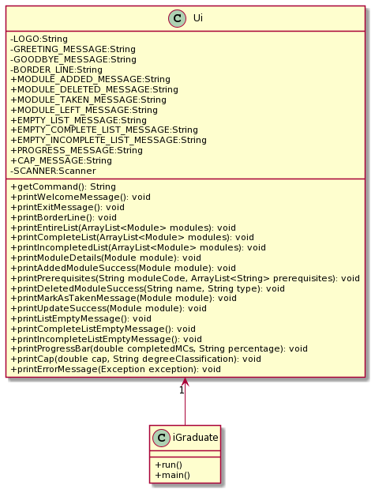

<sup>***Figure 3.2.1** UML class diagram for Ui class*</sup>


The `UI` component:
- Executes user command using the Logic Package which consist of `Command` and `Parser` classes.
- Listens for calls from `Model` package which consist of `ModuleList` and `Module` classes. Model packages will call
  the specific print method to print an output.
- Print method references `Constants` and prints them for user to see.

### 3.3 Logic Component

The logic component consists of  the class `Parser` and the package `command`. They work together to deal
with interpreting user input, identifying the right command to execute as well as the
actual execution of the command. `Parser` identifies the command to run and extracts the parameters and flags
required for the command from user input and passes these values to `command`, which then runs the command.

### 3.3.1 Parser

The `Parser` class is part of the [logic](#33-logic-component) component. 

#### Description

The parser interprets user input and subsequently passes the properly parsed user input to `command` to execute the command.

Given below is the Parser class diagram showing the important methods that returns a `Command` object.

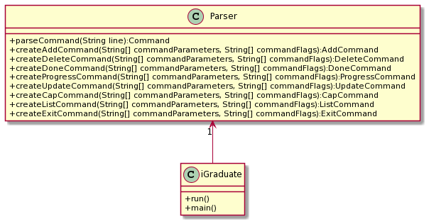

<sup>***Figure 3.3.1.1** UML class diagram for Parser class*</sup>


#### Design

The parser feature contains one class, `Parser.java` and the main function is the `parseCommand()` method.

`parseCommand()`extracts the command phrase entered by the user by extracting the first word of the user input. 
Based on the type of command from the user, `parseCommand()` then calls different methods to extract parameters and 
flags from the user command that are relevant to the command. The parser then creates 
the relevant `Command` object and dispatches the control of the program to the created object. 

> ℹ️ **Note:** Interpretation and checking of parameter validity occurs in the parser. 

The methods that extract various components include
- `extractModuleCode()` - Extracts the module code by checking for the parameter `-c` flag. Invoked with `createAddCommand()`. 
- `extractModuleType()` - Extracts the module type by checking for the parameter `-t` flag. Invoked with `createAddCommand()`. 
- `extractModuleCredits()` - Extracts the module type by checking for the parameter `-mc` flag. Invoked with `createAddCommand()`, `createUpdateCommand()`. 
- `extractModuleGrade()` - Extracts the grade obtained by checking for the parameter `-g` flag. Invoked with `createDoneCommand()`, `createUpdateCommand()`. 
- `extractModuleName()` - Extracts the module name by checking for the parameter `-n` flag. Invoked with `createUpdateCommand()`
- `extractPreRequisites()` - Extracts the prerequisites of the module by checking for the `-p` flag. Invoked with `createAddCommand()`, `createUpdateCommand()`. 
- `extractListScope()` - Extracts the list type. Accepts all, complete,  incomplete or available as acceptable scopes. Invoked with `createListCommand()`. 

which would be invoked based on the command word detected in the user input. 

> ℹ️ **Note:** The Parser also contains checks that ensures the parameters passed are appropriate

The methods that check various parameters include
- `isModuleCodeValid` - Checks that the module code is a valid module code according to the standard for NUS modules. The method uses regex to check for the valid code. There are 2 overloading methods, one for checking a single instance and another for an arraylist to check through a list of module codes. 

### 3.3.2 Command

#### Description
The `command` component executes the correct command based on what the parser interprets.

#### Design
The `command` component consists of an abstract class `Command` and 8 subclasses that inherit from it.

The 8 subclasses are:
* AddCommand
* CapCommand
* DeleteCommand
* DoneCommand
* ExitCommand
* ListCommand
* ProgressCommand
* UpdateCommand

The correct command is executed once the `Command` object is created by the parser by executing the `execute()` method in the correct subclass.
The command execution can affect the `Model` (eg. adding a module).
At the end of each command execution, different methods in the `Ui` will be called to perform certain actions, such as displaying the list of modules to the user.

Below is a Command class diagram.

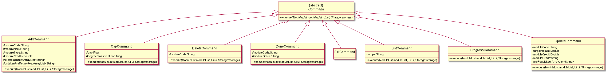

<sup>***Figure 3.3.2.1** UML class diagram for Command class*</sup>

### 3.4 Model Component

The `model` component consists of two main packages that define and deal with data storing issues based on the information 
provided by the user input. The data storing issues are split into two main categories, what data should be included in for a 
module and a container managing the module objects. The `module` package holds the information which acts as a blueprint for 
creating and manipulating module objects while the `list` package consists of a class that defines the way the module objects 
should be managed and stored.

#### 3.4.1 `module` Package

##### Description

The `module` package consists of classes that are used to define the type of data to be stored in a module object and establish 
a framework to show how other components can make use of the features in module classes.

##### Design

The `module` package consists of classes related to module objects. An abstract class `Module` is created to hold attributes 
and methods applicable to all class objects. It is then inherited by all other child module classes. A class diagram illustrating 
the relationship between the interaction of classes under the module package is shown below.

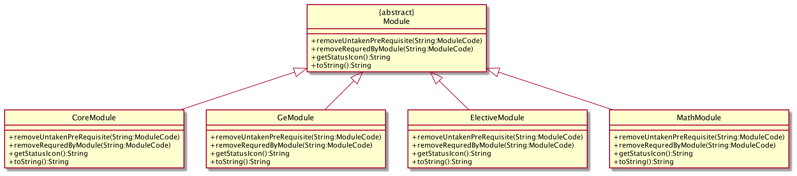

<sup>***Figure 3.4.1.1** UML class diagram for Module package*</sup>

The following child classes are created to handle different types of modules based on the generic module type available in 
the university:
- `CoreModule`
- `GeModule`
- `ElectiveModule`
- `MathModule`

Each of the module classes consists of:
- Attributes related to the module type it is representing
- Getter and setter methods for setting and retrieval of its attributes
- Methods that alter an instance of its own class

#### 3.4.1.1 `Module` Class

`Module` class is an abstract class in the module package. It holds the attributes and methods for manipulating the attributes 
applicable to all modules. The attributes found in the `Module` class are:

Scope   | Type              | Variable             | Description | 
--------|-------------------|----------------------|-------------|
private | String            | code                 | Module code of the module object.
private | String            | name                 | Module name of the module object.
private | double            | credit               | Modular credit of the module object.
private | String            | status               | Status of the module, whether it is “taken”, “not taken” or “taking”.
private | String            | grade                | The grade of taken modules.
private | ArrayList<String> | preRequisites        | A list of prerequisite modules.
private | ArrayList<String> | untakenPreRequisites | A list of unsatisfied prerequisite modules.
private | ArrayList<String> | requiredByModules    | A list of modules requiring the current module as a prerequisite.

The `Module` class also consists of methods that set and get the value of attributes shown in the table above. There are 
four additional methods in the class, namely `removeUntakenPreRequisite`, `removeRequiredByModule`, `getStatusIcon`and `toString`
. The `removeUntakenPreRequisite` and `removeRequiredByModule` methods are used to remove a single`untakenPreRequisites` module 
and `requiredByModules` module respectively, whereas `getStatusIcon` returns the status icon based on the module 
status. For customized formatting of module printing messages, `toString` method is overridden.

#### 3.4.1.2 `CoreModule` Class

The `CoreModule` class inherits from the `Module` class. It initializes the core module object with the information needed and 
contains a `toString` method that overrides the format of core module printing.

#### 3.4.1.3 `GeModule` Class

The `GeModule` class inherits from the `Module` class. It initializes the general education module object with the information needed 
and contains a `toString` method that overrides the format of general education module printing.

#### 3.4.1.4 `ElectiveModule` Class

The `ElectiveModule` class inherits from the `Module` class. It initializes the elective module object with the information needed 
and contains a `toString` method that overrides the format of elective module printing.

#### 3.4.1.5 `MathModule` Class

The `MathModule` class inherits from the `Module` class. It initializes the math module object with the information needed and 
contains a `toString` method that overrides the format of math module printing.

#### 3.4.2 `list` Package

##### Description

The `list` package contains an `ArrayList` of type `Module`, representing
the entire list of `Module` objects added by the user. It also defines the methods used to modify the data of existing `Module` objects,
such as adding, deleting or marking a `Module` as done.

##### Design

The package consists of 1 class, `ModuleList.java`. `ModuleList` contains 2 constructor signatures; 1 for constructing a
new, empty list for when the user uses iGraduate for the first time, and the other to contain the modules already stored
in `Storage`.

##### 3.4.2.1 `ModuleList` Class

The `ModuleList` class acts as an abstraction for the ArrayList that is used to store module objects created from any of the 
classes under the `module` package. It provides a `ModuleList` structure with features built on top of ArrayList to enhance and 
customize its usage for the application. Some data-related methods such as `addModuleRequiredBy` and `removeTakenPreRequisiteModule` 
are added to aid data processing when adding a module to the `ModuleList`. The `ModuleList` class is also used by the `Storage` 
component to generate JSON data of all modules and store it to disk.

Within the class `ModuleList`, different methods are defined to perform different operations on the list of `Modules`. These
operations are:
1. Add a module to the list
2. Delete a module from the list
3. Mark a module as done

##### Adding a module

For adding modules to the list, the methods defined are `add`, `addModuleRequiredBy` and `removeTakenByPrerequisites`.
To add a new module, say `newModule`, `add` is called to perform 3 steps:
1. First, `addModuleRequiredBy`is called to populate the list of modules that require
`newModule` as a prerequisite. 
2. Then, `removeTakenByPrerequisites` checks the list of prerequisites of `newModule` and 
removes the ones that have been marked as taken.
3. Finally, `add` calls `ArrayList.add()` to add `newModule` to the list.

##### Deleting a module

For deleting a module to the list, the methods defined are `delete` and `removeFromPreRequisiteModuleRequiredBy`. To
delete an existing module from the list, say `existingModule`, `delete` is called to perform 2 steps:
1. Firstly, `delete` calls `ArrayList.remove()` to delete `existingModule` from the list.
2. Then, `removeFromPreRequisiteModuleRequiredBy` is called to remove `existingModule` from its pre-requisite modules' 
   requiredBy list.
   
##### Mark module as taken

For marking a module as taken, the methods defined are `markAsTaken` and `removeFromModuleUntakenPrerequisites`. To mark
an existing module as taken, say `existingModule`, `markAsTaken` is called to perform 2 steps:
1. First, `markAsTaken` calls `Module.setStatus` and sets the status of `existingModule` to "taken".
2. Then, `removeFromModuleUntakenPrerequisites` is called to remove `existingModule` from the prerequisitesUntaken table
from the list of modules that require `existingModule` as a prerequisite.

Given below is the class diagram of `ModuleList` showing its 3 main functions.

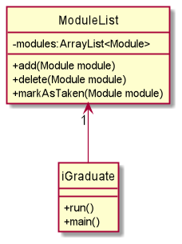

<sup>***Figure 3.4.2.1** UML class diagram for ModuleList class*</sup>

Apart from these 3 operations, the `ModuleList` class also defines getter and setter methods to retrieve values such
as the entire list or an individual module from the list according to different parameters such as module code or index. 

### 3.5 Storage Component

Class Diagram:

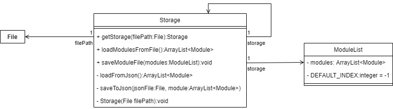

<sup>***Figure 3.5.1** UML class diagram for Storage package*</sup>

The `Storage` Component, 
- Can save `module` objects in the `moduleList` in a JSON format and read them back

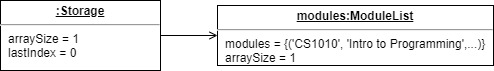

<sup>***Figure 3.5.2** UML object diagram for an instance of storage object*</sup>

### 3.6 Common classes
The common class used by multiple components in this app are in the `exception` package. The `exceptions` are thrown
when an error occurs. The method catches the exceptions and prints out the respective error message. 

Each `exception` is specified by the name and description.

## 4. Implementation

This section elaborates on some details about how certain features are implemented.

### 4.1 UI

UI component
* Executes user command using Logic Component
* Listens to calls from Model data so that UI can print the results.


### 4.2 Parser

The parser feature has 3 primary responsibilities: 
1. Identify the command the user wants to run.
2. Extract the relevant parameters and flags required to run the command
3. Create a new `Command` object and hand it over to `iGraduate` to execute

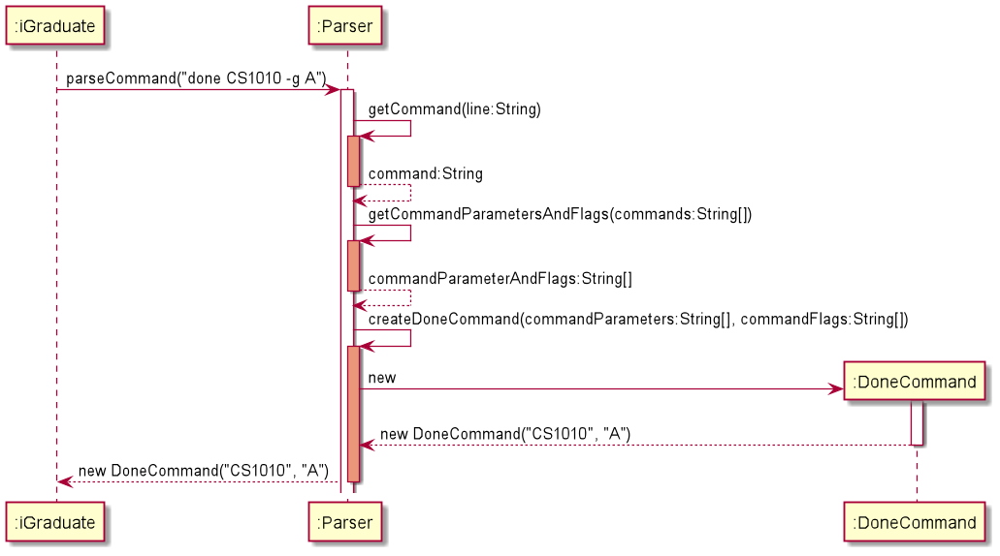

<sup>***Figure 4.2.1** Sequence diagram of `Parser` in execution with *"done CS1010 -g A"** as user input</sup>

#### Details

There are 3 classifications of user input: **command, parameter and flags**. **Command** is the type of 
command the user intends to run and is first word from the user input. The command dictates how `Parser` extracts the 
parameter and flags. The **parameter** is the argument that comes after the command word and can vary depending on the 
command. For example, if the command is `add`, the parameter would be the module name, but for `delete`, the parameter 
would be the module code. Flags come after parameters and are available only for a few commands. They specify the 
additional information required for the command to run. For `add`, flags would be for module code, module type, MCs and 
prerequisites.

#### Considerations

From the start, it was known that `Parser` would be one of the more challenging components to implement due to the large
number of commands and the variance in parameter and flag types. In order to ensure that `Parser` satisfies *Single 
Responsibility Principle*, the class is implemented in a way that it does no validation check on the correctness or 
format of the parameter and flags, and is only responsible for validating the number of flags and parameters in user
input for the given command before passing the parameters and flags to the relevant `Command` class to do further 
validation of the type and formatting of flags and parameters.

### 4.3 Command

The `command` package is responsible for executing the command from the user. The package contains the  abstract class 
`Command` and 8 subclasses that inherit `Command`, one for each valid iGraduate command .

#### Details

The abstract class `Command` contains only 1 method: `execute()`, which takes in 3 parameters: `moduleList`, `ui` and
`storage`. These 3 parameters aid with printing information to the user, making modifications to the data and saving the
data. Each subclass of `Command` overrides `execute()` and implements their own methods to execute the command. Each 
subclass also has a unique constructor signature as each subclass requires different parameters to execute.

#### Implementation

The implementation for executing every command differs, and the implementation details of each of them will be further 
elaborated below.

#### 4.3.1 Add Command

The add command allows a user to add a new module to the list of existing modules. The module name is part of the 
parameters and is extracted directly from user input while the various information required to add a new module are 
included in the flags of the user input. There are 3 compulsory flags and 1 optional flag for adding a module:

1. module code
    - `-c <String>`
1. module credits
    - `-mc <double>`
1. module type
    - `-t <String>`
1. (Optional) prerequisite modules
    - `-p [>String>, ...]`

> ℹ️ **Note:** The order of flags in user input does not matter.

The sequence diagram below shows the execution of add command in action:

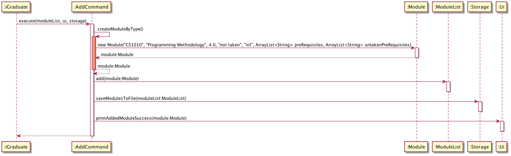

<sup>***Figure 4.3.1.1** Sequence diagram of `AddCommand` in execution with *"add Programming Methodology -c CS1010 -mc 4 -t core"* as user input.*</sup>

#### 4.3.2 Delete Command

The delete command allows for deletion of module from the module list, identified by the module code. There are no flags
involved for deleting a module.

> ℹ️ **Note:** Users cannot delete modules which are prerequisites for other modules.

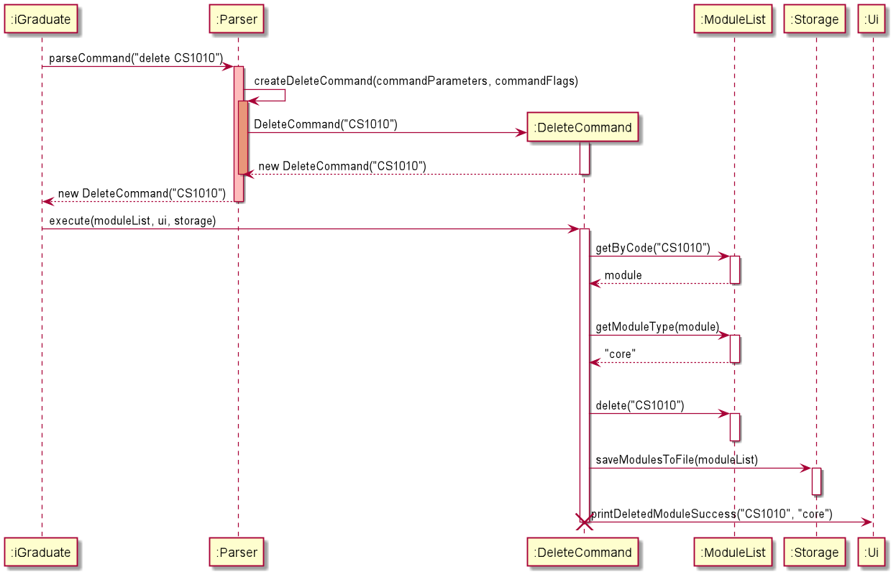
<sup>***Figure 4.3.2.1** Sequence diagram of `DeleteCommand` in execution with "delete CS1010" as user input*</sup>

#### 4.3.3 Update Command

The update commands allows modifications to the existing modules, identified by the module code. 
The information that can be updated include module name, credits, prerequisites and grades (if the module is 
marked as done). 

The update function is executed if the user decides to edit some information regarding a module in the module
list. The various information requested to update would be identified with their flags: 
1. name 
   - `-n <String>`
1. module credits
   - `-mc <int>`
1. prerequisites
   - `-p [<String>, ...]`
1. grade
   - `-g <String>`


> ℹ️ **Note:** The code and type of modules <b>cannot be modified</b> as they are identifiers of the modules.

> ℹ️ **Note:** <b>Multiple module information</b> can be updated in a single command

> ℹ️ **Note:** The command <b>will not update grades</b> if the module requested has not been completed. The rest of 
the information parsed in the command (if any) will be updated. 


#### Details

The following is the UML diagrams for update command consisting of updating each flag.

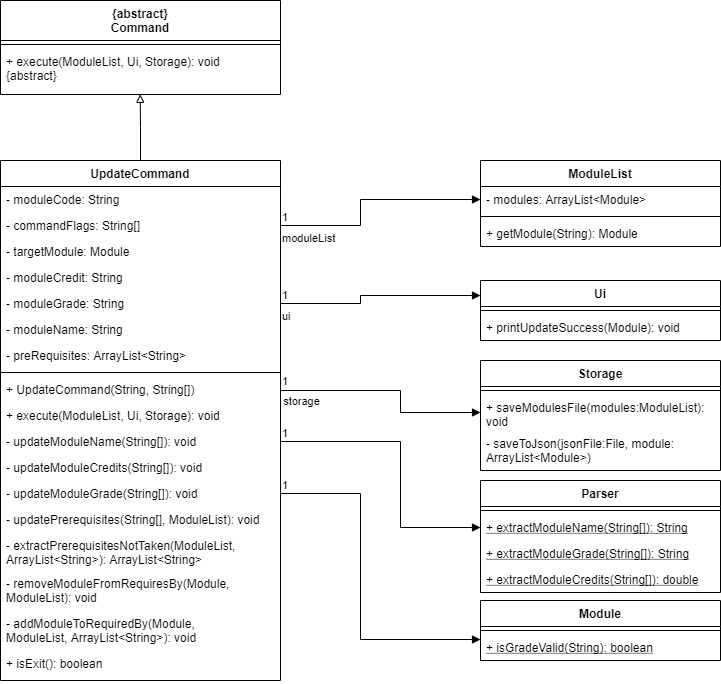

<sup>***Figure 4.3.3.1** Class diagram of `UpdateCommand` class with user input*</sup>


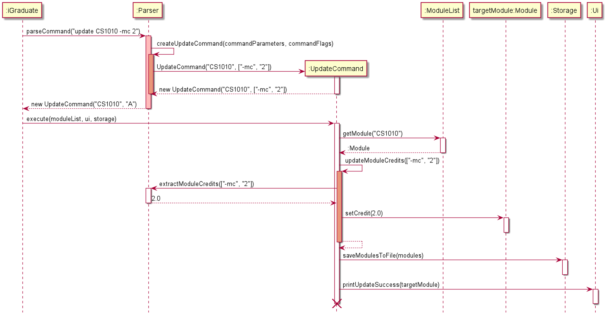

<sup>***Figure 4.3.3.2*** Sequence diagram of `UpdateCommand` in execution with *update CS1010 -mc 2"* as user input</sup>

#### Considerations

#### Alternative


#### 4.3.4 List Command

The list command provides users with 4 options to list down the modules being tracked by iGraduate. The 4 options are:
1. List all modules being tracked:
    - `all`
1. List modules that have been marked as done:
   - `complete`
1. List modules that have not been marked as done:
    - `incomplete`
1. List incomplete modules available to be marked as done based on prerequisites completed:
    - `available`
    

#### 4.3.5 CAP Command

The CAP command calculates the current CAP of the user based on the grades of modules that are marked as done. The 
command also displays the degree classification of the user. There are no flags or additional parameters required.

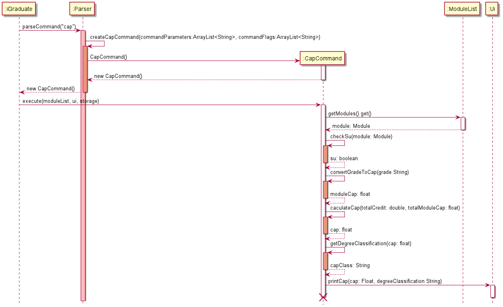

<sup>***Figure 4.3.5.1** Sequence diagram of `CapCommand` class.*</sup>

#### 4.3.6 Done Command

The done command is used to mark a module as completed. To execute this command, the module code is extracted as a 
parameter from user input, and there is 1 compulsory flag:
1. Grade obtained for module
    - `-g <String>`

> ℹ️ **Note:** Only NUS recognised grades are permitted for the grade flag.

> ℹ️ **Note:** iGraduate recognises and supports either 'S' grade or 'U' grade.

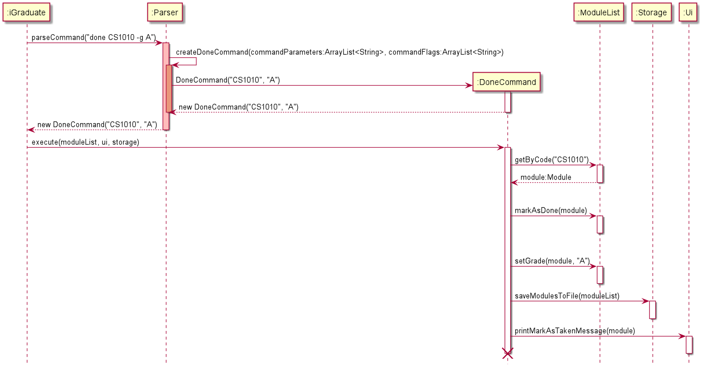

<sup>***Figure 4.3.6.1*** Sequence diagram of `DoneCommand` in execution with *"done CS1010 -g A"* as user input</sup>

#### 4.3.7 Progress Command

The progress command prints a progress bar as well as the user's graduation progress in the form of a percentage. No 
additional flags are required for this command.

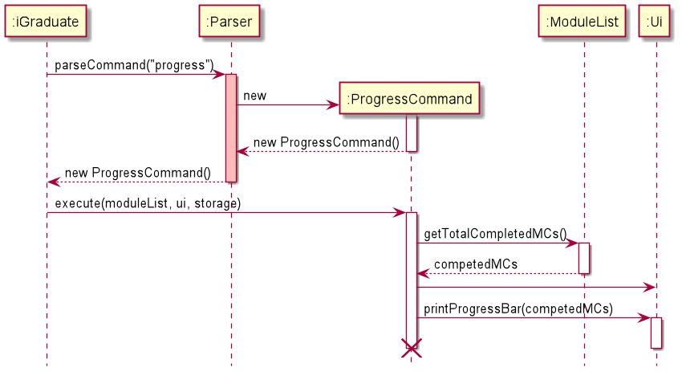

<sup>***Figure 4.3.7.1*** Sequence diagram of `ProgressCommand` in execution.*</sup>

#### 4.3.8 Help Command

The help command provides users with a quick reference guide to the list of available commands, their functions and the
proper format for inputs. Users also have an optional parameter to find the reference guide for a specific command.

The optional parameters are the list of commands from above:
- `add`
- `delete`
- `update`
- `list`
- `done`
- `progress`
- `cap`
- `exit`

If no parameters are provided, a brief description of the program and the available commands will be printed instead.

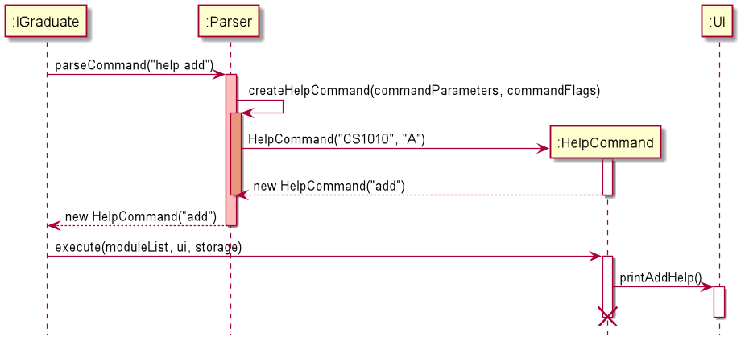
<sup>***Figure 4.3.8.1*** Sequence diagram of `HelpCommand` in execution with `help add` as user input.</sup>

### 4.4 Module

### 4.5 ModuleList

### 4.6 Storage

The storage feature saves the state of the module list after every execution of commands that manipulates 
(i.e. update, add or delete) the modules in the list.

#### Details

The storage function is executed after every command that manipulates (i.e. adds, deletes or updates) the 
modules in the module list, saving the updated state into the storage file. 
The module list is stored in a storage file named `modules.json` in the `data` folder 
(`<program location>/data/modules.json`). 

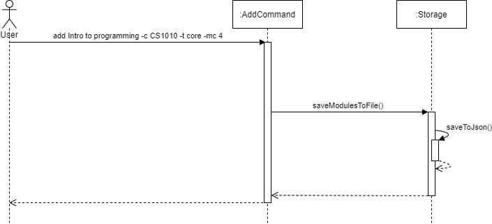

<sup>***Figure 3.5.2** UML sequence diagram showing the life of Storage when the Add command is invoked*</sup>

#### Considerations

The main reason for using a JSON file instead of designing one is to allow a more robust error and exception 
handling and management with regards to modified storage files. The parsing of JSON format is also more 
sophisticated and reliable. 

In addition, the JSON format can be read across multiple different types of applications, allowing flexibility
 in any future implementations regarding exporting of data. 

#### Alternatives

The alternative storage format considered is the use of delimiters. However, there are concerns regarding such
usage; the most important being potential parsing failure from a valid module. With the use of common 
delimiters such as commas `,` and dashes `-`, the program is unable to differentiate between the various 
module information and legitimate module names containing delimiters and may parse the portion of the module 
to a wrong variable, resulting in corrupted results and a potential program crash. One example of such 
occurrence would be a module named `Software Engineering and Object-Oriented Programming`, which contains 
dashes when the delimiters are used for separating various module information is also a dash. 

Considerations were also given to use more unique delimiters (such as \, `|`, etc.) to avoid accidental parsing
fails but the problem still remains. Attempting to fuzz characters would lead to a corrupted storage file and 
render the application useless. Ultimately, the idea was scrapped in favour of the JSON format with a 
third-party library, since the exception handling and parsing management lies in the library functions. 


### 4.7 Exception

Exception is an event that disrupts the normal flow of the diagram. It is an object that is thrown at runtime.
In iGraduate, there are several exceptions that are thrown due to different conditions.

Exception   | Description              
--------|-------------------|
ExistingModuleException | The exception is thrown if the module code input already exists.             | 
IncorrectParameterCountException | The exception is thrown if the parameters given is incorrect.
InputNotNumberException | The exception is thrown if input is not an integer.
InvalidCommandException | The exception is thrown if the command input was invalid.
InvalidListTypeException | Exception is thrown if list command is not followed by: all, incomplete and complete.
InvalidModuleGradeException | The exception is thrown if module grade input is invalid.
InvalidModuleTypeException | The exception is thrown if the module type input is invalid.
LoadModuleFailException | The exception is thrown if module cannot be loaded properly.
ModulularCreditExceedsLimitException | The exception is thrown if the module limit is reached.
ModuleNotCompleteException | The exception is thrown if the module being updated (on grade) has not been completed.
ModuleNotFoundException | The exception is thrown if the module cannot be matched.
PrerequisiteNotFoundException | The exception is thrown if the pre-requisite module cannot be matched.
PrerequisiteNotMetException | Exception is thrown if prerequisite of the module has not been completed.
SaveModuleFailException | This exception is thrown if the program fails to save data to file.
UnableToDeletePrereqModuleException | This exception is thrown when user tries to delete a pre-requisite module.

## Appendix: Requirements

### Product scope

#### Target user profile:

* is a NUS Information Security student
* has a need to manage and plan modules
* has a need to track graduation progress
* has a need to track his/her CAP
* prefer desktop apps over other types
* can type fast
* prefers typing to mouse interactions
* is reasonably comfortable using CLI apps

#### Value proposition:

Allows users to manage modules faster than a typical mouse/GUI driven app.
Includes higher level features such as ability to add modules while ensuring user has cleared all prerequisites
and to list all modules taken, graduation progress and current CAP with degree classification.
This app will help NUS students majoring in information security check his/her graduation progress and modules taken in 
a coherent manner based on the programme requirements.
It also contains tools to help make informed decisions about future modules.

### User Stories

|Version| As a ... | I want to ... | So that I can ...|
|--------|----------|---------------|------------------|
|v1.0|user|see the list of modules I can take now|decide on which modules to register|
|v1.0|user|clearly see which modules I have taken|to check my prerequisites|
|v1.0|user|delete mods that I have added|amend any typos|
|v1.0|user|add new modules that I have taken|track the modules I have taken|
|v1.0|user|utilise the CLI to input my information and execute functions||
|v1.0|user|have my data be persistent|access it again next time when I run the program|
|v1.0|impatient user|access information quickly||
|v1.0|lazy user|access information with as little effort as possible||
|v1.0|user|know my academic progress|estimate my pace and plan for the future|
|v2.0|careless user|know if the module I entered is valid||
|v2.0|user|calculate my current CAP||
|v2.0|user|know if the module I entered is valid|monitor my performance throughout the course of study|
|v2.0|user|see what modules I have already taken|plan what modules to take next semester|
|v2.0|forgetful user|know if I meet the prerequisites for computing modules I want to take||
|v2.0|user|edit the modules for the course|amend my mistakes or changes in module details|
|v2.0|user|be able to pick out any module as my UE||
|v2.0|user|know the pre-requisites of a module|plan my semesters better|
|v2.0|user|see all core modules I have to take||
|v2.0|user|be able to choose any electives of my course||


## Non-Functional Requirements

1. Should work on any mainstream OS as long as it has Java 11 or above installed.
2. Should be able to hold up to 1000 modules without a noticeable sluggishness in performance for typical usage.
3. A user with above average typing speed for regular English text (i.e. not code, not system admin commands) should be able to accomplish most of the tasks faster using commands than using the mouse.
4. A user without online connection should still be able to use the application.
5. A beginner user without prior knowledge should be able to pick up the application comfortably.

## Glossary

* *glossary item* - Definition

## Instructions for manual testing

Given below are instructions to test the app manually.

> ℹ️ **Note:**  These instructions only provide a starting point for testers to work on;
testers are expected to do more *exploratory* testing.

### Launch and shutdown

1. Initial launch

    1. Download the jar file and copy into an empty folder

    1. Run the jar file on your command prompt with the by typing "java -jar iGradute.java" then enter. 
    

2. Shutdown
    
    1. Enter the command `exit` in iGraduate. The program will shutdown by itself.
    
### Adding a module

1. Adding a module into the module list.

    1. Prerequisites: Module does not exist in the module list.
    
    1. Test case: `add Programming Methodology -t core -mc 4 -c CS1010`<br>
       Expected: Module added successfully.
       ````
       Added CS1010 Programming Methodology to the list. (4.0MCs)
       
       [C][✘] CS1010   Programming Methodology                                 NIL   4 MC
       ````
    1. Test case: `add Programming Methodology -t cor -mc 4 -c CS1010`
       Expected: Error in adding module as module type is invalid.
       ````
       The module type you have entered is invalid.
       The supported module types for add are: ue, ge, core and math.
       ````
   1. Test case: `add Programming Methodology -t core -mc -c CS1010`<br>
      Expected:
      Error in adding module as there is incorrect number of parameters given,
      which in this case number of mc is not given.
      ````
      The number of parameters provided is incorrect. 
      Please double check and try again.   
      ````   
    1. Other incorrect add commands to try: `add`, `add nothing` <br>
       Expected: Similar to previous.
       
### Deleting a module

1. Deleting modules from a given module list.
   
    1. Prerequisites: Module list is not empty.
    
    1. Assumption: Module list consists of module CS1010.
    
    1. Test case: `delete CS1010`<br>
       Expected: Module deleted successfully.
       ````
       "Core" module CS1010 has been deleted.
       ````
    1. Test case: `delete CS1020` <br>
       Expected: Error in deleting module as module is not in the list.
       ````
       The module code you have entered does not exists. 
       Please double check and try again.
       ````
    1. Test case: `delet CS1010` <br>
       Expected: Error in deleting module as `delet` is an unknown command word.
       ````
       The command you have entered is incorrect. 
       Please double check and try again.
       ````
    1. Test case: `delete -g A CS1010` <br>
       Expected: Error in deleting module as extra parameter, eg. -g A, is found.
       ````
       The number of parameters provided is incorrect.
       Please double check and try again.
       ````
       
### Marking modules as done

1. Masking modules as done with grade obtained after the semester.
    1. Prerequisites: Module list is not empty.

    1. Assumption: Module list consists of module CS1010.
    
    1. Test case: `done CS1010 -g A+` <br>
       Expected: Module marked as done with grade A+ successfully.
       ````
       Nice! I've marked this module as done:
       [C][✓] CS1010   Programming Methodology                                  A+   2 MC
       ````
    1. Test case: `done CS1020` <br>
       Expected: Error in marking module as done as module is not in the list.
       ````
       The module code you have entered does not exists.
       Please double check and try again.
       ````
    1. Test case: `done CS1010 A+` <br>
       Expected: Error in marking module as done as flag `-g` is not found before the grade `A+`.
       ````
       The number of parameters provided is incorrect.
       Please double check and try again.
       ````
    1. Test case: `done CS1010`<br>
       Expected: Error in marking module as done as incorrect number of parametes is given, eg. missing grade.
       ````
       The number of parameters provided is incorrect.
       Please double check and try again.
       ````
    1. Other incorrect done commands to try: `done`, `done -g A+` <br>
      Expected: Similar to previous.
       
### Updating the module list

1. Update the modules in module list with changes in module credits or module grade.
    1. Prerequisites: Module list is not empty.

    1. Assumption: Module list consists of module CS1010 with 4mcs marked as done with grade A+.
    
    1. Test case: `update CS1010 -g A- -mc 2` <br>
       Expected: Module grade and module credits updated succesfully.
       ````
       Nice! I've updated this module:
       [C][✓] CS1010   Programming Methodology                                  A-   2 MC
       ````
    1. Test case: `update CS1010 -g A-` <br>
       Expected: Module grade updated successfully.
       ````
       Nice! I've updated this module:
       [C][✓] CS1010   Programming Methodology                                   A   4 MC
       ````
    1. Test case: `update CS1010 -mc 2` <br>
       Expected: Module module credits updated successfully.
       ````
       Nice! I've updated this module:
       [C][✓] CS1010   Programming Methodology                                   A+  2 MC
       ````
    1. Test case: `update` <br>
       Expected: Error in updating module as not parameters were given.
       ````
       The number of parameters provided is incorrect.
       Please double check and try again.
       ````
    1. Test case: `update CS1234 -g A- -mc 2` <br>
       Expected: Error in updating module as module is not found in the module list.
       ````
       The module code you have entered does not exists.
       Please double check and try again.
       ````
   1. Test case: `update -g A- -mc 2` <br>
      Expected: Error in updating module as no module name is given.
      ````
      The number of parameters provided is incorrect.
      Please double check and try again.
      ````
    1. Other incorrect update commands to try: `update`, `update CS1010`.
       Expected: Similar to previous.
       
### CAP

1. Display current CAP and degree classification of user.
    1. Assumptions: Module list consists of CS1010 marked as done with 4mcs and grade A+.
    1. Test case: `cap`<br>
       Expected: CAP and degree classification displayed successfully.
       ````
       Current CAP: 4.50
       Current Degree Classification: Honours (Highest Distinction)
       ````
    1. Test case: `cap gg` <br>
       Expected: Error as there is extra parameters found.
       ````
       The number of parameters provided is incorrect.
       Please double check and try again.
       ````
       
### Progress

1. Display user's progress towards graduation.
    1. Assumptions: Module list consists of CS1010 marked as done with 4mcs and grade A+.
    1. Test case: `progress` <br>
       Expected: Progress displayed successfully.
       ````
       Progress:
       
       ░░░░░░░░░░░ 2.50%
       4MCs/160MCs Completed
       ```
    1. Test case: `progress gg` <br>
       Expected: Error as there is extra parameters found.
       ````
       The number of parameters provided is incorrect.
       Please double check and try again.
       ````
       
### List modules

1. List modules in the modules list.
    1. Assumption: Module list consists of CS1010 marked as done and CS2040C not done.
    1. Test case: `list all` <br>
       Expected: All modules listed successfully.
       ````
       Module List:
       1: [C][✓] CS1010   Programming Methodology                                   A   4 MC
       2: [C][✘] CS2040C  Data Structures and Algorithms                          NIL   4 MC
       ````
    1. Test case: `list complete` <br>
       Expected: All completed modules listed successfully.
       ````
       Modules you have have completed:
       1: [C][✓] CS1010   Programming Methodology                                   A   4 MC
       ````
    1. Test case: `list incomplete` <br>
       Expected: All incompleted modules listed sucessfully.
       ````
       Modules you have yet to complete:
       1: [C][✘] CS2040C  Data Structures and Algorithms                          NIL   4 MC
       ````
    1. Test case: `list` <br>
       Expected: Error in listing modules as list type not given.
       ````
       The number of parameters provided is incorrect.
       Please double check and try again.
       ````
    1. Test case: `list all completed` <br>
       Expected: Error in listing modules as list type invalid.
       ````
       The list type you have entered is invalid.
       The supported list types for list are: all, incomplete and complete.
       ````
       
### Saving data

1. Dealing with missing/corrupted data files.
    1. While not in iGraduate, delete json file under `/data` directory. Then start iGraduate. <br>
       Expected: iGraduate accepts current content of files as empty and functions as per normal.
       
    1. While not in iGraduate, corrupt the json file under `/data` directory. Then start iGraduate. <br>
       Expected: iGraduate senses the corrupted files, replace it with empty content and functions as per normal.